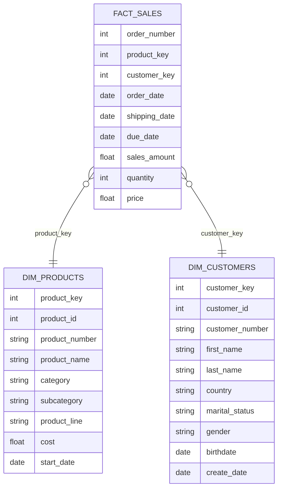

# Sales Data Warehouse & Advanced Analytics Project

This project builds a clean, analysis-ready dimensional model for a retail sales environment.  
Using customer, product, and sales datasets, the project produces a structured **star schema** suitable for BI dashboards, reporting, and downstream analytics.

---

## 📌 Project Overview

The goal of this project is to design and prepare a high-quality analytics dataset using principles commonly used in business intelligence and data warehousing:

- Dimensional modeling (fact and dimension tables)
- Data cleaning & standardization
- Joining datasets into a unified schema
- Enabling sales performance insights (customer behavior, product trends, revenue patterns)

This dataset can be used as the foundation for Power BI dashboards, SQL analysis, or machine learning experiments.

---

## 🧱 Data Model (Star Schema)

**Fact Table**
- `fact_sales`  
  Contains transactional-level sales information such as order dates, quantities, prices, and revenue.

**Dimension Tables**
- `dim_products`  
  Contains product attributes including category, subcategory, product line, and cost.
- `dim_customers`  
  Contains customer demographics such as name, location, gender, marital status, and birthdate.



---

## 🚀 Getting Started

### Prerequisites
- **SQL Server**
- **Datasets**: CSV files containing customer, product, and sales data
- File paths configured in the script (default: `C:\sql\sql-data-analytics-project\datasets\csv-files\`)

### Installation & Setup

1. **Update file paths**
   - Edit `SQLQuery3.sql` to match your local CSV file locations
   - Update paths in the `BULK INSERT` statements

2. **Run the database setup script**
   - Execute `SQLQuery3.sql` in SQL Server Management Studio (SSMS)
   - This will create the DataWarehouseAnalytics database, gold schema, tables, and load data

⚠️ **WARNING**: Running the setup script will drop the entire `DataWarehouseAnalytics` database if it exists. All data will be permanently deleted.

---

## 📊 Analytics Capabilities

This project includes comprehensive SQL analytics organized into analysis categories, with emphasis on **advanced SQL techniques** including CTEs and window functions.

### 1. **Database Exploration**
Queries to understand database structure using `INFORMATION_SCHEMA` views:
- List all tables in the database
- Inspect column definitions, data types, and nullable constraints

### 2. **Dimension Exploration**
Using `DISTINCT` and `ORDER BY`:
- Unique countries from `dim_customers`
- Unique categories, subcategories, and product names from `dim_products`

### 3. **Date Range Analysis**
Using `MIN()`, `MAX()`, `DATEDIFF()`, `GETDATE()`:
- First and last order date with duration in months
- Youngest and oldest customer with calculated ages

### 4. **Measures Exploration**
Core business metrics using aggregation functions:
- Total Sales: `SUM(sales_amount)`
- Total Quantity: `SUM(quantity)`
- Average Price: `AVG(price)`
- Total Orders: `COUNT(DISTINCT order_number)`
- Total Products: `COUNT(product_name)`
- Total Customers: `COUNT(customer_key)`
- Active Customers: `COUNT(DISTINCT customer_key)` from fact_sales

**Unified Report using UNION ALL:**
Combines all key metrics into a single result set with measure names and values.

### 5. **Magnitude Analysis**
Using `GROUP BY` with aggregations and `LEFT JOIN`:
- Total customers by country
- Total customers by gender
- Total products by category
- Average costs by category
- Total revenue by category (joining fact_sales with dim_products)
- Total revenue by customer (with customer names)
- Distribution of sold items across countries

### 6. **Ranking Analysis** ⭐

**Simple Ranking with TOP:**
```sql
SELECT TOP 5
    p.product_name,
    SUM(f.sales_amount) AS total_revenue
FROM gold.fact_sales f
LEFT JOIN gold.dim_products p ON p.product_key = f.product_key
GROUP BY p.product_name
ORDER BY total_revenue DESC;
```

**Advanced Ranking with Window Functions:**
```sql
SELECT *
FROM (
    SELECT
        p.product_name,
        SUM(f.sales_amount) AS total_revenue,
        RANK() OVER (ORDER BY SUM(f.sales_amount) DESC) AS rank_products
    FROM gold.fact_sales f
    LEFT JOIN gold.dim_products p ON p.product_key = f.product_key
    GROUP BY p.product_name
) AS ranked_products
WHERE rank_products <= 5;
```

Queries include:
- Top 5 revenue-generating products
- 5 worst-performing products
- Top 10 highest-revenue customers
- 3 customers with fewest orders

### 7. **Time-Series Analysis**
Temporal aggregations using different date functions:

**Using YEAR() and MONTH():**
```sql
SELECT
    YEAR(order_date) AS order_year,
    MONTH(order_date) AS order_month,
    SUM(sales_amount) AS total_sales,
    COUNT(DISTINCT customer_key) AS total_customers,
    SUM(quantity) AS total_quantity
FROM gold.fact_sales
WHERE order_date IS NOT NULL
GROUP BY YEAR(order_date), MONTH(order_date)
ORDER BY YEAR(order_date), MONTH(order_date);
```

**Using DATETRUNC():**
```sql
SELECT
    DATETRUNC(month, order_date) AS order_date,
    SUM(sales_amount) AS total_sales
FROM gold.fact_sales
WHERE order_date IS NOT NULL
GROUP BY DATETRUNC(month, order_date);
```

**Using FORMAT():**
```sql
SELECT
    FORMAT(order_date, 'yyyy-MMM') AS order_date,
    SUM(sales_amount) AS total_sales
FROM gold.fact_sales
GROUP BY FORMAT(order_date, 'yyyy-MMM');
```

### 8. **Cumulative Analysis** ⭐
**Advanced Window Functions** for running totals and moving averages:

```sql
SELECT
    order_date,
    total_sales,
    SUM(total_sales) OVER (ORDER BY order_date) AS running_total_sales,
    AVG(avg_price) OVER (ORDER BY order_date) AS moving_average_price
FROM
(
    SELECT 
        DATETRUNC(year, order_date) AS order_date,
        SUM(sales_amount) AS total_sales,
        AVG(price) AS avg_price
    FROM gold.fact_sales
    WHERE order_date IS NOT NULL
    GROUP BY DATETRUNC(year, order_date)
) t
```

Calculates:
- Running total of sales over time
- Moving average of price over time

### 9. **Year-over-Year Performance Analysis** ⭐⭐

**Complex CTE with Advanced Window Functions:**

```sql
WITH yearly_product_sales AS (
    SELECT
        YEAR(f.order_date) AS order_year,
        p.product_name,
        SUM(f.sales_amount) AS current_sales
    FROM gold.fact_sales f
    LEFT JOIN gold.dim_products p ON f.product_key = p.product_key
    WHERE f.order_date IS NOT NULL
    GROUP BY YEAR(f.order_date), p.product_name
)
SELECT
    order_year,
    product_name,
    current_sales,
    AVG(current_sales) OVER (PARTITION BY product_name) AS avg_sales,
    current_sales - AVG(current_sales) OVER (PARTITION BY product_name) AS diff_avg,
    CASE 
        WHEN current_sales - AVG(current_sales) OVER (PARTITION BY product_name) > 0 THEN 'Above Avg'
        WHEN current_sales - AVG(current_sales) OVER (PARTITION BY product_name) < 0 THEN 'Below Avg'
        ELSE 'Avg'
    END AS avg_change,
    LAG(current_sales) OVER (PARTITION BY product_name ORDER BY order_year) AS py_sales,
    current_sales - LAG(current_sales) OVER (PARTITION BY product_name ORDER BY order_year) AS diff_py,
    CASE 
        WHEN current_sales - LAG(current_sales) OVER (PARTITION BY product_name ORDER BY order_year) > 0 THEN 'Increase'
        WHEN current_sales - LAG(current_sales) OVER (PARTITION BY product_name ORDER BY order_year) < 0 THEN 'Decrease'
        ELSE 'No Change'
    END AS py_change
FROM yearly_product_sales
ORDER BY product_name, order_year;
```

**Advanced Techniques Used:**
- CTE for yearly aggregation
- `AVG() OVER (PARTITION BY)` for product-level average sales
- `LAG()` for previous year comparison
- Multiple `CASE` statements for trend classification
- Calculates both average comparison and year-over-year change

### 10. **Data Segmentation Analysis** ⭐

**Product Cost Segmentation with CTE:**
```sql
WITH product_segments AS (
    SELECT
        product_key,
        product_name,
        cost,
        CASE 
            WHEN cost < 100 THEN 'Below 100'
            WHEN cost BETWEEN 100 AND 500 THEN '100-500'
            WHEN cost BETWEEN 500 AND 1000 THEN '500-1000'
            ELSE 'Above 1000'
        END AS cost_range
    FROM gold.dim_products
)
SELECT 
    cost_range,
    COUNT(product_key) AS total_products
FROM product_segments
GROUP BY cost_range
ORDER BY total_products DESC;
```

**Customer Segmentation with Complex CTE:**
```sql
WITH customer_spending AS (
    SELECT
        c.customer_key,
        SUM(f.sales_amount) AS total_spending,
        MIN(order_date) AS first_order,
        MAX(order_date) AS last_order,
        DATEDIFF(month, MIN(order_date), MAX(order_date)) AS lifespan
    FROM gold.fact_sales f
    LEFT JOIN gold.dim_customers c ON f.customer_key = c.customer_key
    GROUP BY c.customer_key
)
SELECT 
    customer_segment,
    COUNT(customer_key) AS total_customers
FROM (
    SELECT 
        customer_key,
        CASE 
            WHEN lifespan >= 12 AND total_spending > 5000 THEN 'VIP'
            WHEN lifespan >= 12 AND total_spending <= 5000 THEN 'Regular'
            ELSE 'New'
        END AS customer_segment
    FROM customer_spending
) AS segmented_customers
GROUP BY customer_segment
ORDER BY total_customers DESC;
```

**Segmentation Rules:**
- **VIP**: ≥12 months lifespan AND >5000 spending
- **Regular**: ≥12 months lifespan AND ≤5000 spending
- **New**: <12 months lifespan

### 11. **Part-to-Whole Analysis** ⭐

**Category Contribution with Window Functions:**
```sql
WITH category_sales AS (
    SELECT
        p.category,
        SUM(f.sales_amount) AS total_sales
    FROM gold.fact_sales f
    LEFT JOIN gold.dim_products p ON p.product_key = f.product_key
    GROUP BY p.category
)
SELECT
    category,
    total_sales,
    SUM(total_sales) OVER () AS overall_sales,
    ROUND((CAST(total_sales AS FLOAT) / SUM(total_sales) OVER ()) * 100, 2) AS percentage_of_total
FROM category_sales
ORDER BY total_sales DESC;
```

**Techniques:**
- CTE for category aggregation
- `SUM() OVER ()` for overall total calculation
- Percentage calculation with type casting
- `ROUND()` for decimal precision

---

## 📈 Advanced Reporting Views

The project includes two comprehensive analytical views built with **multi-level CTEs** and complex calculations.

### Customer Report (`gold.report_customers`) ⭐⭐

**Three-level CTE Structure:**

1. **Base Query CTE**: Joins fact_sales with dim_customers, concatenates customer names, calculates age
2. **Customer Aggregation CTE**: Aggregates metrics by customer (orders, sales, quantity, products, lifespan)
3. **Final SELECT**: Applies segmentation logic and calculates KPIs

**Core Fields:**
- `customer_key`, `customer_number`, `customer_name`
- `age`, `age_group` (Under 20, 20-29, 30-39, 40-49, 50 and above)
- `customer_segment` (VIP/Regular/New based on lifespan and spending)
- `last_order_date`, `recency` (months since last order)

**Aggregated Metrics:**
- `total_orders`, `total_sales`, `total_quantity`, `total_products`
- `lifespan` (months from first to last order)

**Calculated KPIs:**
- `avg_order_value`: Total sales ÷ Total orders (with zero-division handling)
- `avg_monthly_spend`: Total sales ÷ Lifespan (handles lifespan = 0 case)

**Segmentation Logic:**
```sql
CASE 
    WHEN lifespan >= 12 AND total_sales > 5000 THEN 'VIP'
    WHEN lifespan >= 12 AND total_sales <= 5000 THEN 'Regular'
    ELSE 'New'
END AS customer_segment
```

### Product Report (`gold.report_products`) ⭐⭐

**Three-level CTE Structure:**

1. **Base Query CTE**: Joins fact_sales with dim_products, filters valid order dates
2. **Product Aggregations CTE**: Aggregates metrics by product using `MIN()`, `MAX()`, `COUNT(DISTINCT)`, calculates avg_selling_price
3. **Final SELECT**: Applies product segmentation and calculates performance KPIs

**Core Fields:**
- `product_key`, `product_name`, `category`, `subcategory`, `cost`
- `last_sale_date`, `recency_in_months` (using `DATEDIFF` with `GETDATE()`)
- `product_segment` (High-Performer/Mid-Range/Low-Performer)

**Performance Segmentation:**
```sql
CASE
    WHEN total_sales > 50000 THEN 'High-Performer'
    WHEN total_sales >= 10000 THEN 'Mid-Range'
    ELSE 'Low-Performer'
END AS product_segment
```

**Aggregated Metrics:**
- `total_orders`, `total_sales`, `total_quantity`, `total_customers`
- `lifespan` (months from first to last sale)
- `avg_selling_price`: `ROUND(AVG(CAST(sales_amount AS FLOAT) / NULLIF(quantity, 0)), 1)`

**Calculated KPIs:**
- `avg_order_revenue`: Total sales ÷ Total orders (with zero-division handling)
- `avg_monthly_revenue`: Total sales ÷ Lifespan (handles lifespan = 0 case)

**Advanced Techniques in Both Views:**
- Multi-level CTEs for query organization
- `CONCAT()` for string concatenation
- `DATEDIFF()` with `GETDATE()` for recency calculations
- Nested `CASE` statements for segmentation
- `NULLIF()` for zero-division prevention
- Type casting with `CAST()` for decimal calculations
- Conditional KPI calculations handling edge cases

---

## 🔍 Sample Queries

### Unified Business Metrics Report
```sql
SELECT 'Total Sales' AS measure_name, SUM(sales_amount) AS measure_value 
FROM gold.fact_sales
UNION ALL
SELECT 'Total Quantity', SUM(quantity) FROM gold.fact_sales
UNION ALL
SELECT 'Average Price', AVG(price) FROM gold.fact_sales
UNION ALL
SELECT 'Total Orders', COUNT(DISTINCT order_number) FROM gold.fact_sales
UNION ALL
SELECT 'Total Products', COUNT(DISTINCT product_name) FROM gold.dim_products
UNION ALL
SELECT 'Total Customers', COUNT(customer_key) FROM gold.dim_customers;
```

### Top Revenue-Generating Products (Window Function)
```sql
SELECT *
FROM (
    SELECT
        p.product_name,
        SUM(f.sales_amount) AS total_revenue,
        RANK() OVER (ORDER BY SUM(f.sales_amount) DESC) AS rank_products
    FROM gold.fact_sales f
    LEFT JOIN gold.dim_products p ON p.product_key = f.product_key
    GROUP BY p.product_name
) AS ranked_products
WHERE rank_products <= 5;
```

### Monthly Sales Trend with Running Total
```sql
SELECT
    order_date,
    total_sales,
    SUM(total_sales) OVER (ORDER BY order_date) AS running_total_sales
FROM (
    SELECT 
        DATETRUNC(month, order_date) AS order_date,
        SUM(sales_amount) AS total_sales
    FROM gold.fact_sales
    WHERE order_date IS NOT NULL
    GROUP BY DATETRUNC(month, order_date)
) t;
```

### Customer Segmentation Analysis
```sql
WITH customer_spending AS (
    SELECT
        c.customer_key,
        SUM(f.sales_amount) AS total_spending,
        DATEDIFF(month, MIN(order_date), MAX(order_date)) AS lifespan
    FROM gold.fact_sales f
    LEFT JOIN gold.dim_customers c ON f.customer_key = c.customer_key
    GROUP BY c.customer_key
)
SELECT 
    customer_segment,
    COUNT(customer_key) AS total_customers
FROM (
    SELECT 
        customer_key,
        CASE 
            WHEN lifespan >= 12 AND total_spending > 5000 THEN 'VIP'
            WHEN lifespan >= 12 AND total_spending <= 5000 THEN 'Regular'
            ELSE 'New'
        END AS customer_segment
    FROM customer_spending
) AS segmented_customers
GROUP BY customer_segment;
```

---

## 📁 Project Structure

```
sql-data-analytics-project/
│
├── datasets/
│   └── csv-files/
│       ├── gold.dim_customers.csv
│       ├── gold.dim_products.csv
│       └── gold.fact_sales.csv
│
├── SQLQuery3.sql              # Main database setup & analytics script
├── README.md                  # Project documentation
└── .gitignore
```

---

## 🛠️ Advanced SQL Techniques Demonstrated

This project showcases sophisticated SQL patterns and functions:

### 1. **Common Table Expressions (CTEs)**
- Multi-level CTEs in reporting views (base_query → aggregation → final select)
- CTEs for year-over-year analysis
- CTEs for customer and product segmentation
- CTEs for part-to-whole analysis

### 2. **Window Functions**
- **Ranking Functions**: `RANK()`, `DENSE_RANK()`, `ROW_NUMBER()`
- **Aggregate Window Functions**: 
  - `SUM() OVER (ORDER BY ...)` for running totals
  - `AVG() OVER (ORDER BY ...)` for moving averages
  - `SUM() OVER ()` for overall totals
  - `AVG() OVER (PARTITION BY ...)` for partitioned averages
- **Analytical Functions**: `LAG()` for previous period comparisons
- **PARTITION BY** for group-wise calculations

### 3. **Date and Time Functions**
- `YEAR()`, `MONTH()` for date part extraction
- `DATETRUNC()` for period standardization
- `FORMAT()` for custom date formatting
- `DATEDIFF()` for period calculations
- `GETDATE()` for current date reference

### 4. **Aggregation Functions**
- `SUM()`, `COUNT()`, `AVG()`, `MIN()`, `MAX()`
- `COUNT(DISTINCT)` for unique counts
- `NULLIF()` for zero-division prevention

### 5. **Conditional Logic**
- Complex nested `CASE` statements for segmentation
- Multi-condition `CASE` for trend analysis
- `CASE` with calculations for KPIs

### 6. **String Functions**
- `CONCAT()` for name concatenation

### 7. **Type Conversion**
- `CAST()` for decimal calculations and percentage computations
- `ROUND()` for decimal precision control

### 8. **Set Operations**
- `UNION ALL` for combining multiple query results

### 9. **Join Techniques**
- `LEFT JOIN` for preserving all fact records
- Multi-table joins across fact and dimension tables

### 10. **View Creation**
- Parameterized views with complex logic
- Drop and recreate pattern with `IF OBJECT_ID EXISTS`

---

## 📊 Key Performance Indicators (KPIs)

This project enables tracking of critical business metrics:

### Revenue Metrics
- Total Sales Revenue
- Average Order Value (AOV)
- Revenue by Category/Product/Customer
- Monthly Revenue Trends

### Customer Metrics
- Total Customers
- Active Customers (with orders)
- Customer Lifetime Value (CLV)
- Customer Acquisition by Period
- Recency, Frequency, Monetary (RFM) scores

### Product Metrics
- Total Products Available
- Products Sold
- Average Selling Price
- Product Performance Rankings
- Category Contribution

### Operational Metrics
- Total Orders
- Items Sold (Quantity)
- Order Fulfillment Patterns
- Geographic Distribution

---

## 🎯 Use Cases

This data warehouse supports various analytical scenarios:

1. **Executive Dashboards**: High-level KPIs and trends
2. **Marketing Analysis**: Customer segmentation and targeting
3. **Sales Performance**: Territory and product analysis
4. **Inventory Planning**: Product demand patterns
5. **Financial Reporting**: Revenue recognition and forecasting
6. **Customer Success**: Retention and churn analysis

---

## ⚠️ Important Notes

- The database setup script is **destructive** - it will drop existing data
- File paths must be updated to match your local environment
- Ensure SQL Server has permission to access the CSV file locations
- All monetary values are assumed to be in Euro (€)
- Date formats should match SQL Server expectations (YYYY-MM-DD)

---

## 🔜 Future Enhancements

Potential areas for expansion:

- [ ] Add time dimension table for more sophisticated date analysis
- [ ] Implement slowly changing dimensions (SCD Type 2)
- [ ] Create additional calculated measures in views
- [ ] Add data quality checks and validation scripts
- [ ] Develop stored procedures for automated refresh
- [ ] Integrate with Power BI for visualization
- [ ] Add geographic dimension for deeper location analysis
- [ ] Implement incremental loading strategies

---

## 📚 Learning Resources

This project demonstrates concepts from:
- Data warehousing and dimensional modeling (Kimball methodology)
- SQL Server T-SQL programming
- Business intelligence and analytics
- Window functions and advanced SQL techniques

---

## 🤝 Contributing

Contributions are welcome! Areas for improvement:
- Query optimization
- Additional analytical patterns
- Documentation enhancements
- Example visualizations

---

## 📄 License

This project is available for educational and commercial use.

---

## 👤 Author

**Your Name**
- GitHub: [@irfanibrahimy](https://github.com/irfanibrahimy)
- LinkedIn: [Irfan Ibrahim](www.linkedin.com/in/irfan-ibrahim-180317284)

---

## 🙏 Acknowledgments

- Inspired by real-world data warehousing best practices
- Built using Microsoft SQL Server
- Follows dimensional modeling principles from industry standards
